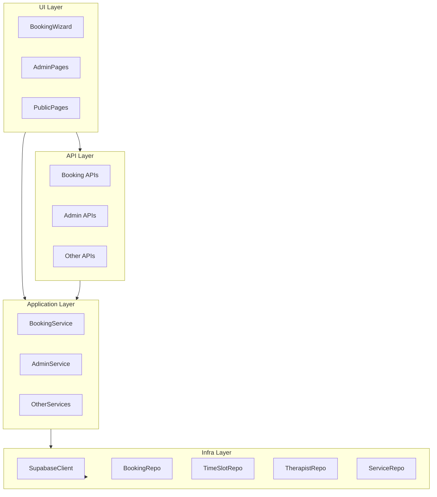

### High-level approach

- **Goal**: Introduce a strict 4-layer architecture (UI, API, application, infra) around the existing Next.js + Supabase Serenity Spa app, preserving all behavior and public contracts while improving separation of concerns, testability, and logging.
- **Strategy**: Incrementally introduce domain, infra, and application layers, then refactor API routes and UI components to depend on them. Maintain temporary adapters where necessary to avoid breaking behavior while migrating.
- **Key constraints**: No Supabase usage outside infra layer, no business logic in API/UI, no HTTP concerns in application layer, no route/response changes, and booking locking/confirmation must remain race-condition safe.

### Current-state summary (from exploration)

- **Supabase usage**
  - Central clients in `lib/supabase/client.ts` and `lib/supabase/server.ts` used across server components, API routes, and UI client components.
  - Legacy DB wrappers in `lib/db/bookings.ts`, `lib/db/therapists.ts`, `lib/db/schedule.ts` implementing table CRUD with Supabase.
  - Multiple pages/components (`BookingWizard.tsx`, admin pages, public services pages, schedule/messages admin) directly query Supabase, tightly coupling UI to infra.
- **Booking-related APIs & logic**
  - `/api/booking/availability`, `/api/booking/lock`, `/api/booking/confirm` contain both HTTP concerns and core booking rules (locking, double-booking prevention, slot availability).
  - Admin booking status changes are done directly in `app/(admin)/admin/bookings/page.tsx` via browser Supabase; some legacy `BookingRow` component expects a missing `/api/admin/bookings`.
- **Domain & validation**
  - Central zod schemas and inputs live in `lib/utils/validation.ts`; DB-oriented types live in `lib/db/*`; additional ad-hoc types are defined inside UI components.
- **Logging & errors**
  - `lib/utils/logger.ts` provides basic structured logging (`debug`, `info`, `warn`, `error`) but without correlation IDs or unified error/response mapping; each API route defines its own error shape.

### Target architecture layout

- **Domain layer (`lib/domain`)**
  - Shared TypeScript domain models (`booking.types.ts`, `therapist.types.ts`, `service.types.ts`, `timeSlot.types.ts`, etc.).
  - Zod schemas for inputs and invariants, likely refactored from `lib/utils/validation.ts` and component-local schemas.
  - Domain error hierarchy (`errors.ts`): `DomainError`, `NotFoundError`, `ConflictError`, `ValidationError`, `UnauthorizedError`, plus domain-specific codes.
- **Application layer (`lib/application`)**
  - Use-case-oriented services: `booking.service.ts`, `therapist.service.ts`, `service.service.ts` or `admin.service.ts` (for admin CRUD and RBAC), and potentially `profile.service.ts`, `contact.service.ts`.
  - Each service exposes pure functions/methods that:
    - Accept explicit context (e.g., `userId`, `userRole`, correlationId) and DTOs.
    - Orchestrate domain rules and call repositories.
    - Throw domain errors and return domain models, with no HTTP or Supabase knowledge.
- **Infra layer (`lib/infra/supabase`)**
  - `client.ts`: wraps existing Supabase initialization for server/browser, centralizing config and logging.
  - Repositories (e.g., `booking.repo.ts`, `therapist.repo.ts`, `service.repo.ts`, `timeSlot.repo.ts`, `schedule.repo.ts`, `profile.repo.ts`, `message.repo.ts`) encapsulating all Supabase queries.
  - Repositories expose interfaces used by the application layer; no business rules, only data access and simple mapping.
- **Utils (`lib/utils`)**
  - `logger.ts`: upgraded to structured, context-aware logger with correlation IDs.
  - `errorMapper.ts`: centralized mapping from `DomainError` (and unknown errors) to HTTP status codes and standard `{ success: false, error: { code, message } }` response objects.
- **UI & API layers**
  - UI (Next.js pages, client/server components) only depend on application services and domain types; no direct Supabase, no infra imports.
  - API routes become thin controllers: validate with zod, call application services, map domain errors via `errorMapper`, and return standardized JSON.

### Detailed step-by-step plan

#### 1. Introduce the domain layer

- **1.1 Create domain types**
  - Add `lib/domain/booking.types.ts`, `therapist.types.ts`, `service.types.ts`, `timeSlot.types.ts`, and any other needed domain models.
  - Base these on existing DB types in `lib/db/*` and in-component types (e.g., `Service`, `Therapist`, `TimeSlot` in `BookingWizard.tsx`), ensuring they capture all fields currently used in UI/API.
  - Where the DB schema includes technical fields (`created_at`, etc.) that UI/API treat opaquely, keep them in domain types to avoid behavior changes.
- **1.2 Centralize validation schemas into domain**
  - Move or re-export booking-related and admin-related zod schemas from `lib/utils/validation.ts` into domain modules:
    - Booking: `bookingConfirmSchema`, `BookingConfirmInput` into `booking.types.ts` or `booking.schema.ts`.
    - Admin: `adminServiceSchema`, `adminTherapistSchema`, `adminTimeSlotCreateSchema`, `adminBookingStatusSchema` into appropriate domain files.
    - Other: relevant profile/contact/auth schemas may remain for now but with a clear path into domain.
  - Ensure existing imports from `lib/utils/validation.ts` keep working during transition by re-exporting from that file, then gradually update call sites to use `lib/domain/*`.
- **1.3 Define domain error hierarchy**
  - Create `lib/domain/errors.ts` with:
    - `class DomainError extends Error { code: string; details?: unknown; }`.
    - `class ValidationError extends DomainError`, `NotFoundError`, `ConflictError`, `UnauthorizedError`, etc.
  - Define a small set of standardized error codes for booking/admin flows (e.g., `SLOT_TAKEN`, `SERVICE_NOT_FOUND`, `THERAPIST_NOT_ASSIGNED`, `UNAUTHORIZED`, etc.) that match or map cleanly to existing error `code` values in APIs.

#### 2. Build the infra/repository layer

- **2.1 Consolidate Supabase client creation**
  - Create `lib/infra/supabase/client.ts` that wraps `getServerSupabaseClient` / `getBrowserSupabaseClient` logic from `lib/supabase/server.ts` and `lib/supabase/client.ts`, using the enhanced `logger` and returning a typed Supabase client.
  - Update internal imports in new repositories to use this central client.
  - Keep existing `lib/supabase/*` exports as thin pass-throughs initially to avoid breaking current callers; later, migrate callers to use the new infra client where appropriate.
- **2.2 Convert `lib/db/*` modules into repositories**
  - For each existing DB module:
    - `lib/db/bookings.ts` → `lib/infra/supabase/booking.repo.ts`.
    - `lib/db/therapists.ts` → `lib/infra/supabase/therapist.repo.ts`.
    - `lib/db/schedule.ts` → `lib/infra/supabase/schedule.repo.ts` (and possibly time-slot-specific repo `timeSlot.repo.ts` if separation helps).
  - Define clear repository interfaces (e.g., `BookingRepository`, `TherapistRepository`) using domain types, exposing methods like `findById`, `listByFilters`, `create`, `updateStatus`, etc.
  - Implement these interfaces with Supabase queries only; no business logic or error-code translation beyond mapping low-level errors to `DomainError` instances where necessary.
- **2.3 Create additional repositories as needed**
  - Add repos for other tables currently accessed directly from UI/API:
    - `service.repo.ts` for `services` and `therapist_service` relations.
    - `timeSlot.repo.ts` for `time_slots` with methods such as `findAvailableByTherapistAndDate`, `lockSlot`, `markAsBooked`.
    - `profile.repo.ts` for `profiles` lookups/updates; can later be used by middleware and profile APIs.
    - `message.repo.ts` for contact/message persistence and rate limiting.
  - Implement transactional/atomic operations where required by booking integrity, using the Supabase/Postgres primitives available (e.g., single `update` with conditions, RPC where already configured, or row-level constraints), mirroring current lock queries.

#### 3. Implement the application services layer

- **3.1 Booking service (`lib/application/booking.service.ts`)**
  - Define a service API encapsulating booking use cases, e.g.:
    - `getAvailability({ serviceId, therapistId, date }, deps)` – uses `serviceRepo`, `therapistRepo`, `timeSlotRepo` to:
      - Ensure therapist is linked to service.
      - Fetch relevant slots and filter by `is_available` and `locked_until` (matching current logic).
    - `lockSlot({ userId, timeSlotId }, deps)` – orchestrates atomic locking via `timeSlotRepo.lockSlot`, throwing `ConflictError` with code `SLOT_TAKEN` when the update fails.
    - `confirmBooking({ userId, timeSlotId, ...otherDetails }, deps)` – checks existing bookings, creates a new booking, and updates the corresponding time slot as unavailable, mirroring existing API logic.
  - Accept repositories via dependency injection (e.g., a `deps` object) so the service can be unit-tested with mocks.
  - Ensure no HTTP or Supabase usage; only domain models, repository calls, and domain errors.
- **3.2 Admin services (`lib/application/admin.service.ts`)**
  - Implement admin-focused use cases:
    - `listServices`, `createService`, `updateService`, `deleteService` (using `serviceRepo`).
    - `listTherapists`, `createTherapist`, `updateTherapist`, `deleteTherapist` (using `therapistRepo`).
    - `createTimeSlot`, `updateTimeSlot`, `listSchedule` (using `timeSlotRepo`/`scheduleRepo`).
    - `updateBookingStatus` and possibly `listBookings` (using `bookingRepo`).
  - Enforce RBAC in the application layer by requiring a user context, e.g. `AdminContext { userId: string; role: 'admin' | 'customer' | ... }`, and throwing `UnauthorizedError` when `role !== 'admin'`.
- **3.3 Additional services (optional but aligned)**
  - `therapist.service.ts` and `service.service.ts` can encapsulate non-admin, customer-facing operations as needed (e.g., listing public services, fetching therapist details) to remove Supabase from public pages.
  - `profile.service.ts` for profile updates and `contact.service.ts` for contact form submissions and rate limiting, each delegating to the proper repositories.

#### 4. Introduce centralized logging & error mapping

- **4.1 Enhance `logger.ts`**
  - Extend `lib/utils/logger.ts` to:
    - Support a `correlationId` field in log context.
    - Provide structured logging with clearly separated `level`, `message`, and `context` (e.g., `{ level, message, context: { correlationId, module, errorName, ... } }`).
    - Offer helpers to derive a child logger with fixed context (e.g., `withContext({ correlationId })`).
- **4.2 Implement `errorMapper.ts`**
  - Add `lib/utils/errorMapper.ts` that exposes:
    - A function `mapErrorToHttp(error: unknown): { status: number; body: { success: false; error: { code: string; message: string } } }`.
    - Logic to map domain errors:
      - `ValidationError` → 400.
      - `NotFoundError` → 404.
      - `ConflictError` → 409.
      - `UnauthorizedError` → 401.
      - Default/unknown → 500 with generic code.
  - Ensure the `code` matches existing API error codes (e.g., `SLOT_TAKEN`) where applicable to avoid breaking clients.

#### 5. Refactor API routes into thin controllers

- **5.1 Booking APIs**
  - `app/api/booking/availability/route.ts`:
    - Replace inline validation with zod schemas from `lib/domain`.
    - Generate or obtain a `correlationId` per request and attach it to logs.
    - Call `bookingService.getAvailability` with domain input and repository dependencies.
    - Wrap the call in a try/catch that uses `errorMapper` to produce `{ success: false, error }` responses.
  - `app/api/booking/lock/route.ts`:
    - Ensure auth via Supabase (using the infra client) at the API boundary only to derive `userId` and roles; pass them as context into `bookingService.lockSlot`.
    - Delegate lock logic to the service, which in turn uses the `timeSlotRepo` for atomic updates.
  - `app/api/booking/confirm/route.ts`:
    - Use `bookingConfirmSchema` from domain for request validation.
    - Call `bookingService.confirmBooking`, returning `{ success: true, data }` with an unchanged shape.
- **5.2 Admin APIs**
  - `app/api/admin/services/route.ts` and `app/api/admin/therapists/route.ts`:
    - Move all Supabase access and CRUD logic into `admin.service.ts` + related repos.
    - Use admin-specific zod schemas from `lib/domain`.
    - Derive user context (id, role) via Supabase or middleware and pass into admin services.
    - Rely on `errorMapper` for error responses.
  - Restore or implement a thin `app/api/admin/bookings/route.ts` (if needed) that proxies admin booking status operations to application services, matching the expectations of any existing admin UI components.
- **5.3 Other APIs (profile, contact, profile/password)**
  - Gradually migrate `profile`, `contact`, and `profile/password` APIs to:
    - Use domain schemas and errors.
    - Delegate logic to corresponding application services.
    - Remove any browser Supabase usage from route handlers in favor of infra repos and server client.

#### 6. Refactor UI layer to depend on services/APIs only

- **6.1 Booking wizard (`components/booking/BookingWizard.tsx`)**
  - Remove direct Supabase client usage for `services` and `therapist_service` lookups:
    - Replace with calls to existing or new API endpoints (e.g., `/api/services`, `/api/therapists-for-service`) or with server-side data fetched in the surrounding page that calls application services.
  - Preserve the current wizard step flow and user-visible behavior exactly.
  - Keep all HTTP calls going through the existing booking APIs (availability, lock, confirm) whose contracts are preserved.
- **6.2 Admin pages**
  - `app/(admin)/admin/bookings/page.tsx`:
    - Replace direct Supabase updates to `bookings.status` with calls to an admin bookings API that backs onto `admin.service.ts`.
    - Keep UI behavior, filtering, and status options unchanged.
  - `app/(admin)/admin/services/page.tsx`, `app/(admin)/admin/therapists/page.tsx`, `app/(admin)/admin/schedule/page.tsx`, `app/(admin)/admin/messages/page.tsx`:
    - Remove any remaining direct Supabase usage from client components.
    - Ensure they call admin APIs only, which then call application services and infra repos.
- **6.3 Public/server-rendered pages**
  - `app/(public)/services/page.tsx` and `app/(public)/services/[id]/page.tsx`:
    - Replace direct `getServerSupabaseClient` usage with calls into `service.service.ts` (application layer) that in turn use `serviceRepo`.
    - Ensure no import from `lib/infra/`* or Supabase in UI code.

#### 7. Enforce booking integrity and atomicity

- **7.1 Preserve and centralize locking semantics**
  - Ensure `booking.service.ts` uses repository methods that:
    - Atomically lock a time slot (using conditional update with `is_available` and `locked_until` checks, or Supabase RPC if already present) to prevent race conditions.
    - Respect `locked_until` TTL as implemented today.
  - Unit-test these service methods with mocked repos to assert behavior under contention (e.g., concurrent lock attempts produce `ConflictError` with `SLOT_TAKEN`).
- **7.2 Confirm booking semantics**
  - Move double-booking checks and slot marking into `booking.service.ts`:
    - Ensure that confirming a booking checks for existing bookings on the same `time_slot_id` and fails with a `ConflictError` on conflict.
    - Ensure `time_slots.is_available` is set to false when a booking is confirmed.
  - Keep external API responses identical while delegating logic to the service.

#### 8. Testing readiness and validation

- **8.1 Service-level unit tests (no Supabase)**
  - Use Vitest (already present) to create tests for application services, mocking repository interfaces.
  - Cover main booking flows (availability, lock, confirm) and admin flows (services CRUD, therapists CRUD, booking status updates).
- **8.2 Integration/smoke tests for APIs**
  - Reuse or extend the existing `tests/*.test.ts` to ensure API routes still:
    - Accept the same payloads.
    - Return the same shapes and status codes for success and known errors.

### Architectural diagram (conceptual)

### File mapping highlights (non-exhaustive)

- **Domain**
  - From `lib/utils/validation.ts` → `lib/domain/*.ts` (with re-exports for backward compatibility).
  - From `lib/db/bookings.ts`, `lib/db/therapists.ts`, `lib/db/schedule.ts`, and `BookingWizard`-local types → `lib/domain/*types.ts`.
- **Infra**
  - From `lib/supabase/client.ts`, `lib/supabase/server.ts` → `lib/infra/supabase/client.ts`.
  - From `lib/db/`* → `lib/infra/supabase/*repo.ts`.
- **Application**
  - New files: `lib/application/booking.service.ts`, `lib/application/admin.service.ts`, `lib/application/therapist.service.ts`, `lib/application/service.service.ts` (as needed).
- **API**
  - Controllers: `app/api/booking/*/route.ts`, `app/api/admin/*/route.ts`, `app/api/profile/*/route.ts`, `app/api/contact/route.ts` refactored to thin controllers using `errorMapper` and services.
- **UI**
  - Pages/components currently using Supabase directly updated to:
    - Use application services (for server components) or API routes (for client components).
    - Import only from `lib/application/`* and `lib/domain/`* (plus generic utilities).

This plan allows an incremental but comprehensive migration to the desired architecture while strictly preserving public behavior and preparing the codebase for robust testing and future scalability.