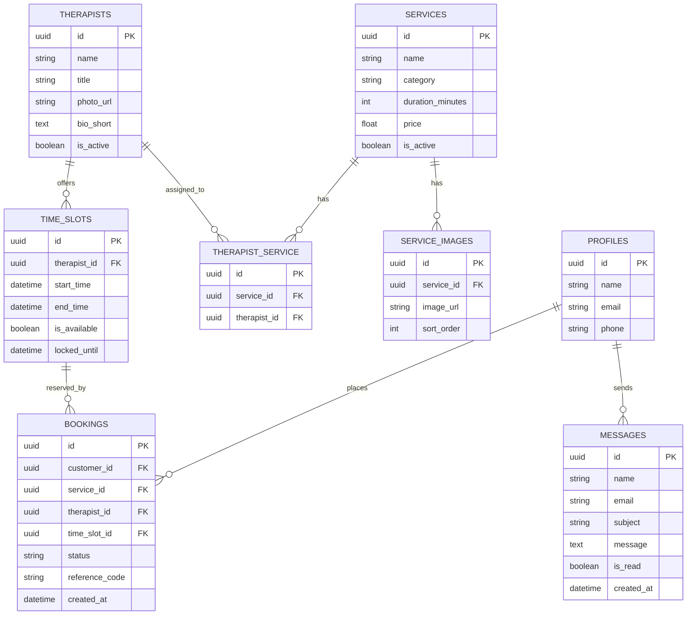
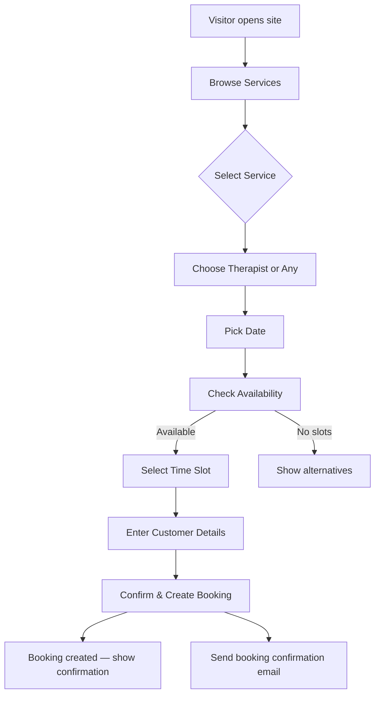
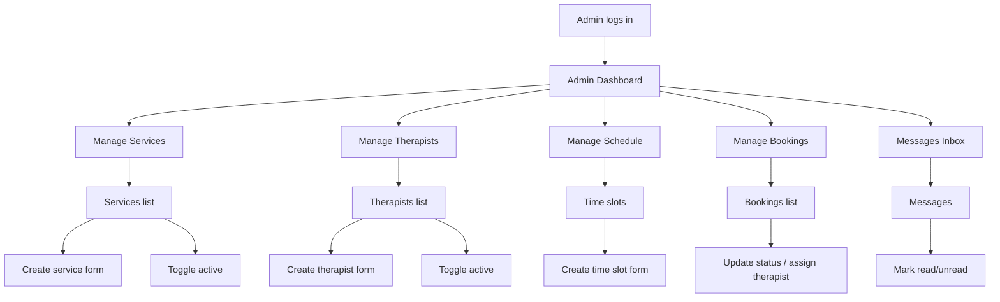

# Booking App — Detailed Architecture, Decisions, and Design

This document explains the architecture, design decisions, development principles, and future improvements for the Booking App (spa booking). It's meant to help maintainers, contributors, and reviewers understand how the system is organized and why certain choices were made.

**Scope:** server/backend patterns, frontend structure (Next.js app router), data model, auth, admin UIs, operational concerns, testing, and future roadmap.

---

## 1. Intent & Motivation

- **Primary goal:** Provide a simple, reliable booking experience for spa customers while allowing administrators to manage services, therapists, schedules, bookings, and messages.
- **Design priorities:** safety (data integrity), clarity (simple APIs and helpers), developer productivity (Next.js + Supabase), and production readiness (observability & minimal ops).
- **Target users:** customers (book treatments), admins (manage catalog & schedules), and internal maintainers.

## 2. High-level Architecture

- **Frontend:** Next.js (App Router). Pages use a mix of server components for SSR/SSG and client components for interactivity (admin UIs, forms).
- **Backend / DB:** Supabase (Postgres + auth). Business logic partly lives in server-side helpers that wrap Supabase queries (`lib/db/*`).
- **APIs:** App uses Next.js server routes under `app/api/*` for centralized operations where needed. Admin client UIs also talk directly to the database via the browser Supabase client for quick iteration.
- **Auth & Sessions:** Supabase auth is the primary identity provider. Server code uses a server Supabase client with secure service keys where appropriate; client code uses an anon/publishable key.

Diagram (informal):

- Next.js (routes & components)
  - Server components (SSR pages, data-loading)
  - Client components (forms, interactive admin pages)
- Supabase (Postgres + Auth)
  - `lib/supabase/*` helpers manage client creation (browser and server)
  - `lib/db/*` modules provide typed DB helpers

## 3. Repo & File Layout (key folders)

- `app/`: Next.js app router; pages, layouts, and API routes.
  - `app/(admin)/` — admin section with layout and pages (dashboard, services, therapists, schedule, bookings, messages).
  - `app/api/*` — server endpoints used by client parts or third-party integrations.
- `components/`: shared and admin UI components (forms, cards, layout pieces).
- `lib/`: app logic and infra helpers.
  - `lib/supabase/` — `client.ts` (browser client), `server.ts` (server client adapter)
  - `lib/db/` — typed data access helpers (bookings, therapists, schedule)
  - `lib/services/` — higher-level functions (e.g., user helpers, auth service)
  - `lib/utils/` — logging, validation, small helpers
- `docs/`: architecture, setup, deployment notes, and this document.

## 4. Data Model & DB Patterns

- Core tables: `services`, `therapists`, `time_slots`, `bookings`, `messages`, `profiles`.
- Access pattern: thin helpers in `lib/db/*` centralize queries and map results to typed returns (e.g., `listTherapists()`, `createBooking()`). This keeps page code concise and reduces duplication.
- Error handling: helpers throw on Supabase errors; calling pages/caller code catch and log using `lib/utils/logger`.

## 5. Auth, Authorization & Security

- Auth provider: Supabase Auth.
- Server-only operations use the service role key in a safe context (`lib/supabase/server.ts`) and use Next.js `cookies()` integration to handle session cookies.
- Admin routes and layouts verify the current user role (admin) using `getCurrentUser()` and middleware protects admin paths.
- Principle: minimize the surface area of service-role usage and prefer server-side checks for privileged actions.

## 6. Supabase Integration Details

- Two client types:
  - `getBrowserSupabaseClient()` — used by client components in the admin UI (created with publishable/anon key).
  - `getServerSupabaseClient()` — used by server components and API routes; uses service key and Next.js cookies adapter.
- Cookie adapter & typing: server adapter uses Next's `cookies()` to satisfy `@supabase/ssr` expectations while keeping TypeScript types strict.

## 7. Frontend: Server vs Client Components

- Use Server Components for pages that primarily render based on server data (public pages, many admin lists where SSR is acceptable).
- Use Client Components (`"use client"`) for interactive admin management pages: create/update forms, toggles, and frequent client-side mutations.
- Pattern followed in repo: admin "services" and "messages" use client components with `getBrowserSupabaseClient()` for responsive CRUD UIs; new therapists/schedule/bookings admin pages follow the same pattern.

## 8. Admin UX & Design Patterns

- Admin layout (`app/(admin)/admin/layout.tsx`) provides a left navigation for quick access to dashboard, services, therapists, schedule, bookings, messages.
- Each admin page follows a consistent structure: list table, lightweight inline actions (toggle, status change), and a create form section.
- Form validation is centralized in `lib/utils/validation.ts` (Zod schemas) and used by all admin forms.

## 9. Error Handling, Logging & Observability

- `lib/utils/logger` provides centralized logging for errors and important events.
- Pages and API routes log Supabase errors; helpers prefer to throw and let the page or route decide how to respond.
- Recommendations for production:
  - Add structured logging (JSON) and forward logs to an external system (Datadog, Logflare, etc.).
  - Add metrics for key flows (bookings created, booking failures, auth failures).

## 10. Testing Strategy

- Unit tests: focus on `lib/utils/*` and validation rules.
- Integration tests: mock Supabase responses for `lib/db/*` helpers and test page-level behavior.
- E2E: use Playwright or Cypress to exercise the booking flow and admin CRUD operations.

## 11. Deployment & Ops

- Minimal deployment model works well with Vercel or Netlify for Next.js and Supabase as managed Postgres.
- Environment variables required:
  - `NEXT_PUBLIC_SUPABASE_URL`, `NEXT_PUBLIC_SUPABASE_ANON_KEY` for client
  - `SUPABASE_SERVICE_ROLE_KEY` for server usage
- Suggested CI steps: `pnpm lint`, `pnpm tsc --noEmit`, `pnpm test`.

## 12. Security & Privacy Considerations

- Keep service role keys confidential and restrict access to CI/deployment.
- Sanitize and validate all user inputs (Zod schemas + server-side checks).
- Rate-limit public endpoints (e.g., booking availability) with middleware if exposed to the internet.

## 13. Design Decisions & Trade-offs

- Choice of Supabase: accelerates development (auth + Postgres + realtime). Trade-off: some operations require careful server-side handling when using service keys.
- Mixing direct browser DB calls and server routes: improves developer speed but requires robust RBAC checks and server-side fallbacks for sensitive operations.
- Use of App Router & server components: prioritizes SEO and performance for public pages while allowing interactive admin experiences.

## 14. Future Improvements & Roadmap

- Implement full edit flows for admin resources (edit dialogs, richer validation).
- Add pagination, filtering and search for admin tables.
- Add unit and integration tests for `lib/db/*` helpers.
- Add monitoring (Sentry/Datadog), performance tracing for critical requests.

## 15. Contribution & Coding Guidelines

- Follow the existing code style and prefer small, focused commits.
- When adding features, add/update Zod schemas in `lib/utils/validation.ts` and tests validating them.
- Document any infra or schema changes in `docs/` and the migration plan.

---

If you'd like, I can:

- Expand any section above (e.g., add ER diagrams, example API contracts, or coding style rules).
- Add a short `docs/README_FOR_CONTRIBUTORS.md` with how to run the app locally, environment variables, and common developer tasks.

Tell me which section you want expanded next.

## 16. ER Diagram

Below is an entity-relationship diagram representing the primary data model for the booking app. It shows the key tables and relationships used by the application.

Notes:
- `THERAPIST_SERVICE` is a join table mapping which therapists can provide which services.
- `TIME_SLOTS` are owned by `THERAPISTS` and may be locked temporarily to prevent double-booking.
- `BOOKINGS` reference `time_slots` for the reserved interval and connect to `profiles` (customers), `services`, and optionally `therapists`.

## 17. User Flows (Mermaid)

Below are two high-level user flow diagrams (customer booking flow and admin flow) that show the main screens/actions and decisions.

### Booking Flow

### Admin Flow (Manage Resources)

Explanations:
- Availability checks occur in server routes that test `time_slots` and `bookings` to avoid double-booking. Admin schedule edits update `time_slots` and may trigger re-evaluation of locked slots.
- Admin actions are mostly immediate client-driven DB mutations using the browser Supabase client; sensitive workflows (refunds, service deletes) should be validated server-side.

---

If you'd like, I can convert these Mermaid diagrams into PNG/SVG files, or add them as separate `docs/diagrams/` assets. Tell me which format you prefer.

